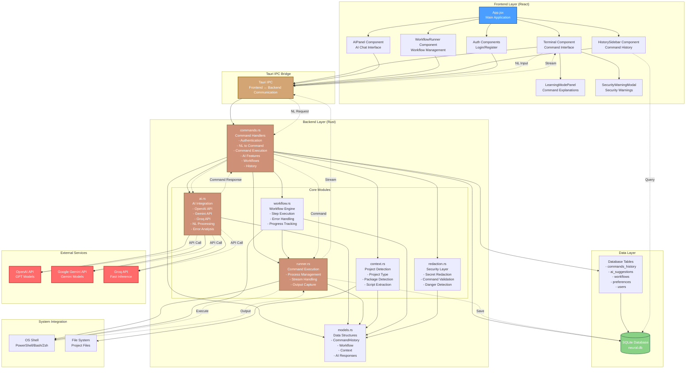
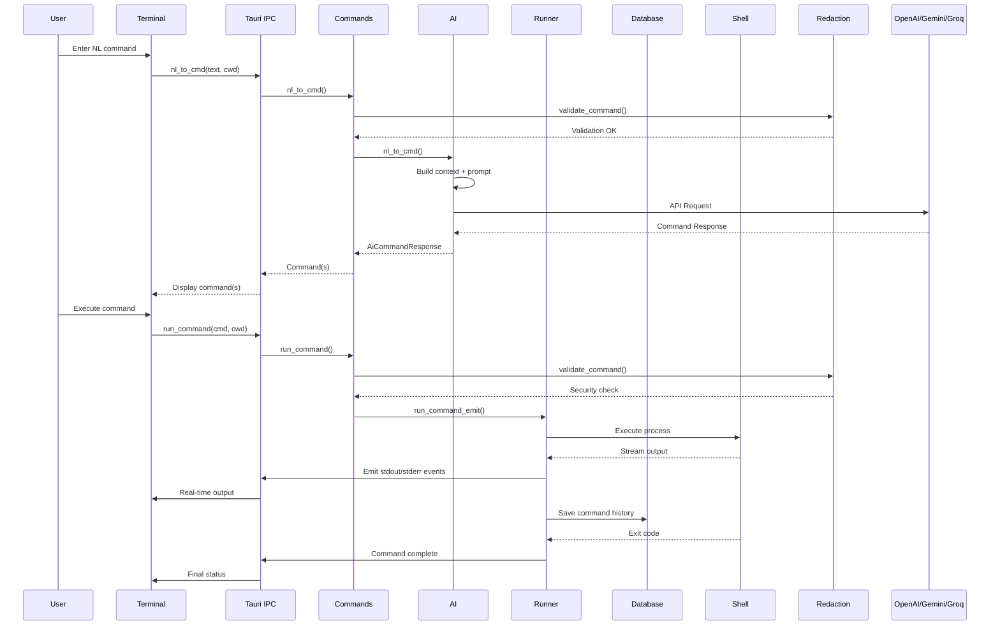
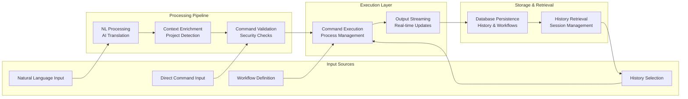

# Project Neural - System Architecture

## Architecture Diagram

## Component Interaction Flow

## Data Flow Architecture

## Technology Stack

### Frontend
- **React** - UI Framework
- **Vite** - Build Tool
- **CSS Modules** - Styling

### Backend
- **Rust** - Core Language
- **Tauri** - Desktop Framework
- **Tokio** - Async Runtime
- **SQLite (rusqlite)** - Database
- **Reqwest** - HTTP Client

### External Services
- **OpenAI API** - GPT Models
- **Google Gemini API** - Gemini Models
- **Groq API** - Fast Inference

### System Integration
- **OS Shell** - PowerShell (Windows), Bash (Linux), Zsh (macOS)
- **File System** - Project file scanning
